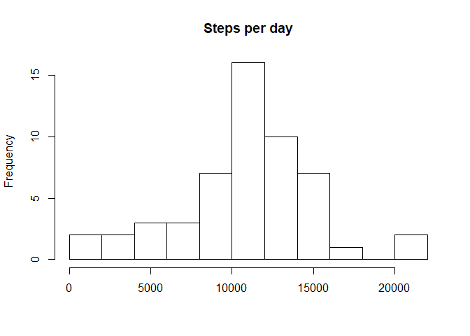
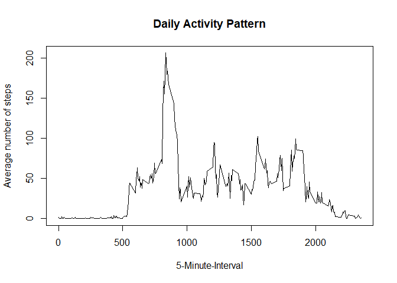
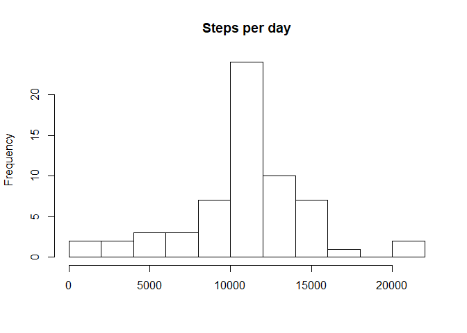

```r
library(ggplot2)
```

## Loading and preprocessing the data

```r
activity <- read.csv("activity.csv")
activity$date <- as.Date(activity$date)
completeactivity <- activity[complete.cases(activity),]
histogramdata <- tapply(completeactivity$steps, completeactivity$date, FUN=sum)
hist(histogramdata, 10, main = "Steps per day", xlab = "")
```

<!-- -->


## What is mean total number of steps taken per day?

```r
mean(histogramdata)
```

```
## [1] 10766.19
```

```r
median(histogramdata)
```

```
## [1] 10765
```


## What is the average daily activity pattern?

```r
plotdata<-tapply(completeactivity$steps, completeactivity$interval, mean)
plot(y = plotdata, x = names(plotdata), type = "l", xlab = "5-Minute-Interval", 
    main = "Daily Activity Pattern", ylab = "Average number of steps")
```

<!-- -->

```r
max_steps <- max(plotdata)
plotdata[plotdata == max_steps]
```

```
##      835 
## 206.1698
```

## Imputing missing values

```r
sum(is.na(activity$steps))
```

```
## [1] 2304
```

```r
sum(is.na(activity$date))
```

```
## [1] 0
```

```r
sum(is.na(activity$interval))
```

```
## [1] 0
```


```r
activityImputed <- activity
missingSteps <- is.na(activityImputed$steps)

avgSteps <- tapply(activityImputed$steps, activityImputed$interval, mean, na.rm=TRUE, simplify=T)
activityImputed$steps[missingSteps] <- avgSteps[as.character(activityImputed$interval[missingSteps])]

histogramdata <- tapply(activityImputed$steps, activityImputed$date, FUN=sum)
hist(histogramdata, 10, main = "Steps per day", xlab = "")
```

<!-- -->


```r
mean(histogramdata)
```

```
## [1] 10766.19
```

```r
median(histogramdata)
```

```
## [1] 10766.19
```


## Are there differences in activity patterns between weekdays and weekends?


```r
is_weekday <- function(d) {
    dayoftheweek <- weekdays(d)
    ifelse (dayoftheweek == "sábado" | dayoftheweek == "domingo", "weekend", "weekday")
}

weekfactor <- sapply(activityImputed$date, is_weekday)
activityImputed$weekfactor <- as.factor(weekfactor)


averagedActivityImputed <- aggregate(steps ~ interval + weekfactor, data=activityImputed, mean)

ggplot(averagedActivityImputed, aes(interval, steps)) + 
geom_line() + facet_grid(weekfactor ~ .) + xlab("5-minute interval") +  ylab("avarage number of steps")
```

<!-- -->


